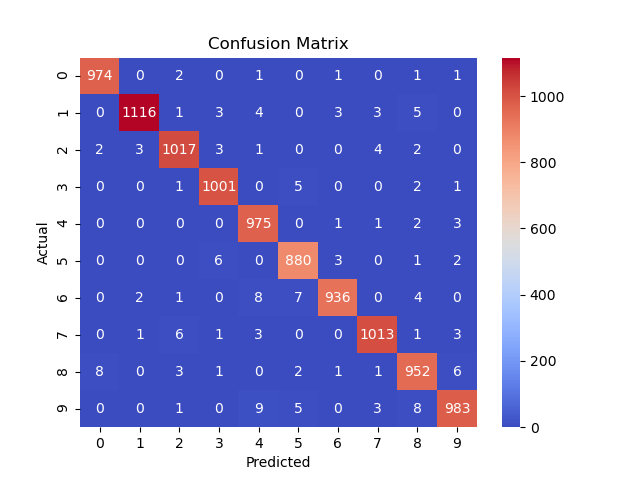
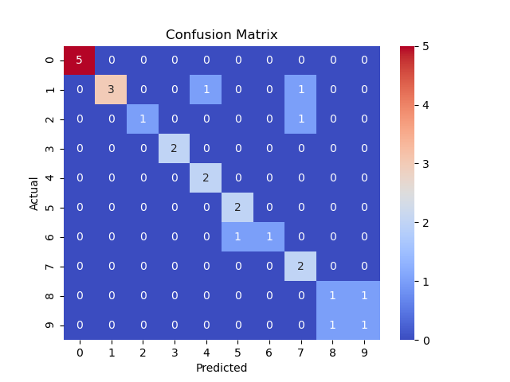

# digit-reader

Model
```
model = Sequential([
    Conv2D(32, (5, 5), activation='relu', input_shape=(28, 28, 1)),
    MaxPooling2D(pool_size=(3, 3)),
    Conv2D(32, (3, 3), activation='relu'),
    MaxPooling2D(pool_size=(2, 2)),
    Flatten(),
    Dense(48, activation='relu'),
    Dense(10, activation='softmax'),
])
```

MNIST test data set - `0.9866` accuracy




My own digits data set - `0.9615` accuracy



### No augmentation
Without augmentation (train-pure.py) I get higher accuracy `0.99`++ on mnist dataset, but it fails miserably on my own data set.