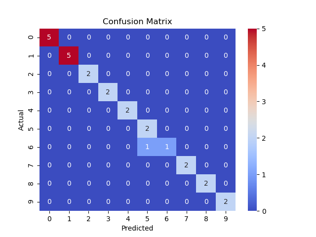

# digit-reader

Model
```
model = Sequential([
    Conv2D(48, (7, 7), activation='relu', input_shape=(28, 28, 1)),
    MaxPooling2D(),
    Flatten(),
    Dense(48, activation='relu'),
    Dense(10, activation='softmax'),
])
```

MNIST test data set - `0.9847` accuracy


My own digits data set - `0.7692` accuracy

